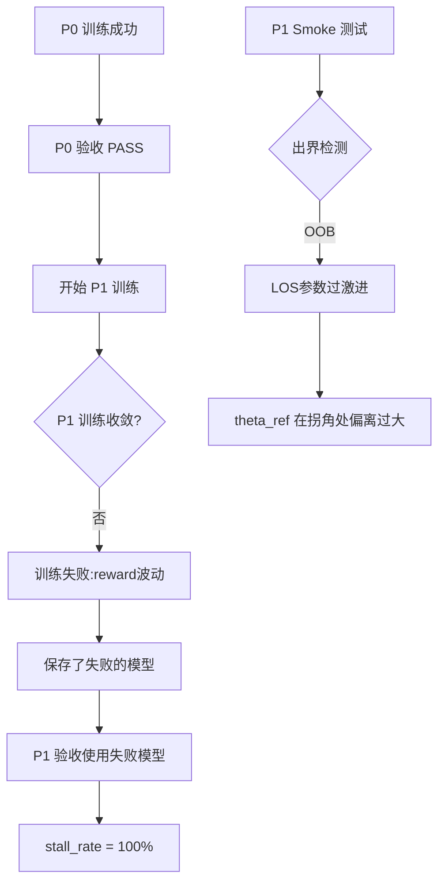

# P1 验收失败问题分析报告

## 1. 问题概述

P1 自动化验收运行完成，但结果为 **FAIL**：
- `success_rate`: **0.0**
- `stall_rate`: **1.0**
- `mean_progress_final`: **0.00179**（约0.18%进度）
- 所有50个episode均以 `stall` 终止，智能体几乎原地不动

> [!CAUTION]
> 当前P1模型完全无法正常运行，智能体在起点附近就触发停滞（stall）检测。

---

## 2. 根本原因分析

### 2.1 模型混用问题（核心原因）

| 验收阶段 | 使用的模型路径 | 训练时间 | 配置来源 |
|---------|--------------|---------|---------|
| P1 eval | `20251227_030122/latest_checkpoint.pth` | 03:01 | `train_square_p1.yaml`（含LOS） |
| P0 baseline | `20251227_092744/best_model.pth` | 09:27 | `train_square_p0.yaml`（无LOS） |

**关键发现**：
1. `20251227_030122` 目录下的模型是使用 **P1 配置**（`use_los: true`）训练的，但训练**未能收敛**
2. `20251227_092744` 目录下的模型是使用 **P0 配置**（无LOS）训练的，成功通过P0验收
3. P1验收时，系统使用了训练失败的P1模型，而非基于P0成功模型继续训练

### 2.2 P1 训练失败的证据

**训练日志分析** (`20251227_030122/logs/training_log.csv`)：
- Episode 0-390，reward 剧烈波动：**-238 到 -2397**
- 没有明显的收敛趋势
- 典型失败特征：高方差、无下降趋势

```
episode 0:  reward = -238
episode 10: reward = -1521  ← 恶化
episode 54: reward = -1778  ← 继续恶化
episode 110: reward = -2220  ← 严重恶化
episode 372: reward = -2397  ← 最差点
```

### 2.3 P1 Smoke 测试问题

**Smoke 结果**（`p1_smoke/summary.json`）：
- `done_reason`: **oob**（出界）
- `progress_final`: **0.182**（仅完成18%）
- `max_abs_contour_error`: **0.784**（接近边界 epsilon=1.5 的一半）
- `steps`: **145**（远低于完整轨迹所需的 ~731 步）

**Trace 分析**（`p1_smoke/trace.csv`）：
- 从 step 118 开始，`theta_ref` 开始变化（LOS 前瞻生效）
- 在 step 145：`contour_error = 0.784`，触发出界终止
- LOS 前瞻在拐角前"提前转向"，但转向幅度过大导致出界

> [!IMPORTANT]
> P1 Smoke 使用零动作策略（ω=0, v=0.5*v_max），本应验证 `theta_ref` 的连续性。
> 结果显示 LOS 参数（`L0=4.4, Lmin=2.2, Lmax=13.2`）导致在拐角处切入过深。

---

## 3. 问题链条图



---

## 4. 核心问题总结

| # | 问题 | 严重程度 | 说明 |
|---|-----|---------|-----|
| 1 | **P1 训练未收敛** | 🔴 严重 | 训练390个episode，reward无收敛趋势 |
| 2 | **LOS 参数过于激进** | 🟡 中等 | Smoke测试出界，`L0=4.4` 可能过大 |
| 3 | **模型选择错误** | 🔴 严重 | 应基于 P0 成功模型继续训练，而非从头训练 |
| 4 | **缺乏迁移学习** | 🟡 中等 | P1 应加载 P0 最佳模型作为初始权重 |

---

## 5. 配置文件关键差异

### P0 配置（成功）vs P1 配置（失败）

```diff
reward_weights:
+  p1:
+    use_los: true        # P1 新增
+    L0: 4.4              # 前瞻距离基础值
+    Lmin: 2.2            # 最小前瞻距离
+    Lmax: 13.2           # 最大前瞻距离
+    kL: 0.01             # 速度增益系数
+    deadzone_corner_ratio: 0.3  # 拐角允差
+    deadzone_straight_ratio: 0.0
+    w_ang_acc: 0.5       # 角加速度惩罚权重
```

这些P1特性改变了：
1. **参考方向计算**：从当前路径切线 → LOS 前瞻方向
2. **误差计算**：引入 deadzone，允许拐角偏离
3. **奖励结构**：增加角加速度惩罚

---

## 6. 下一步建议

详见 [P1_fix_workflow.md](./P1_fix_workflow.md) 修复工作流。
