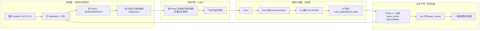

# PPO 项目执行泳道图（FINAL v1.8）
版本日期：2026-01-03

> 泳道图目标：把你的工作拆成 4 条并行泳道：  
> **研究者（你） / 工程实现（Codex） / 验收与证据（工具链） / 论文产物（tex）**  
> 每完成一个 Phase，都必须触发“自动生成论文图表”。

---

## 1) 总览（Mermaid 泳道图）

---

## 2) 里程碑顺序（按“目标逻辑”）
1) **B1（B0）**：观测口径/分段指标/plotter 对齐 → 生成 baseline 图包  
2) **B2a**：拐角平滑（至少 1 个不退化且改善的 run）  
3) **B2b**：出弯回线（解决慢漂）  
4) **B2c**：直线效率（速度提升）  
5) **C**：论文图表自动化（paper_assets 一键生成）  
6) **D**：消融与对比（tab_ablation + fig_ablation_vis）

---

## 3) 每个 Phase 的“完成条件”（一句话）
- **B1**：能自动计算分段指标 + P0_L2 一键出图  
- **B2a/b/c**：main_table 新增行 + 4 张对比图 + 1 页摘要  
- **C**：paper_assets 生成齐全且 tex 可直接引用  
- **D**：ablation_table 填满 + 自动生成消融图表

---
