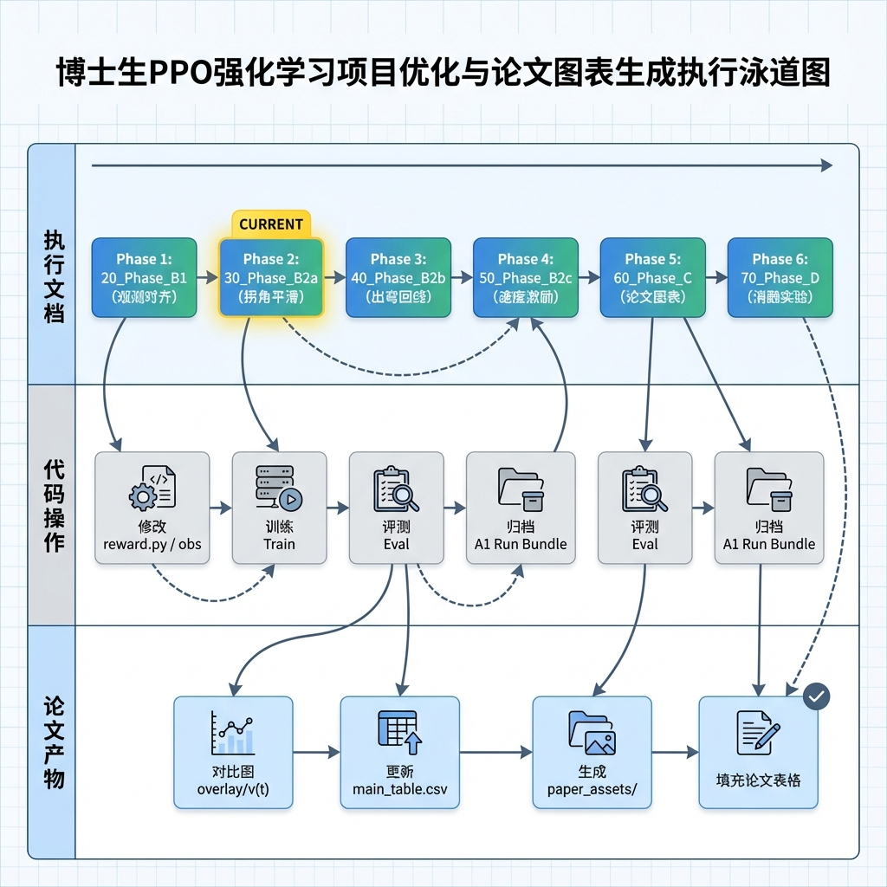
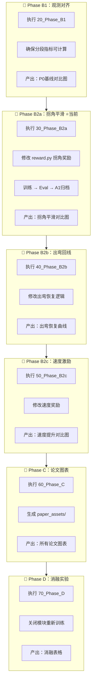

# PPO项目执行指南：文档→代码→论文

> **目标**：完成代码优化 + 生成论文图表

---

## 执行流程总览





---

## 每个Phase的具体执行步骤

### 🔵 Phase B1：观测对齐（可选/快速）

| 步骤 | 操作 | 产出 |
|------|------|------|
| 1 | 打开 `20_Phase_B1_FINAL_v1.8.md` | 理解要求 |
| 2 | 确认分段指标可计算（corner_mask） | 代码检查 |
| 3 | 生成 P0 基线图 | `P0_overlay.png`, `P0_v_t.png` |

---

### 🟢 Phase B2a：拐角平滑 ⭐ **当前重点**

| 步骤 | 操作 | 产出 |
|------|------|------|
| 1 | 打开 `30_Phase_B2a_FINAL_v1.8.md` | 理解平滑性指标 |
| 2 | 修改 `src/reward.py` | 增加拐角平滑奖励 |
| 3 | 创建 `configs/train_square_b2a.yaml` | 训练配置 |
| 4 | 运行训练 | `saved_models/b2a_seed42/` |
| 5 | 运行评测 | `summary.json`, `trace.csv` |
| 6 | A1 归档 | `artifacts/B2a_xxx/` |
| 7 | 生成对比图 | P0 vs B2a 的 overlay/v(t)/ω(t) |

---

### 🟡 Phase B2b：出弯回线

| 步骤 | 操作 | 产出 |
|------|------|------|
| 1 | 打开 `40_Phase_B2b_FINAL_v1.8.md` | |
| 2 | 修改出弯恢复相关奖励/状态 | |
| 3 | 训练 → Eval → A1归档 | |
| 4 | 生成出弯恢复曲线 | recovery_time 对比 |

---

### 🟠 Phase B2c：速度激励

| 步骤 | 操作 | 产出 |
|------|------|------|
| 1 | 打开 `50_Phase_B2c_FINAL_v1.8.md` | |
| 2 | 修改直线段速度奖励 | |
| 3 | 训练 → Eval → A1归档 | |
| 4 | 生成速度对比图 | 直线段速度提升 |

---

### 🔴 Phase C：论文图表自动生成

| 步骤 | 操作 | 产出 |
|------|------|------|
| 1 | 打开 `60_Phase_C_FINAL_v1.8.md` | |
| 2 | 创建 `paper_assets/` 目录 | |
| 3 | 批量生成所有对比图 | `figures/*.png` |
| 4 | 导出表格数据 | `tables/tab_results.csv` |
| 5 | 更新 tex 引用路径 | 论文直接引用 |

---

### ⚫ Phase D：消融实验

| 步骤 | 操作 | 产出 |
|------|------|------|
| 1 | 打开 `70_Phase_D_FINAL_v1.8.md` | |
| 2 | 关闭 KCM 重新训练 | ablation_no_kcm |
| 3 | 关闭拐角奖励重新训练 | ablation_no_corner |
| 4 | 生成消融表格和图 | `tab_ablation.csv` |

---

## 文档执行顺序速查表

```
当前位置 → 下一步执行的文档
━━━━━━━━━━━━━━━━━━━━━━━━━━━━━━━━━
P0基线完成 → 20_Phase_B1 或直接跳到 30_Phase_B2a
B2a完成    → 40_Phase_B2b
B2b完成    → 50_Phase_B2c
B2c完成    → 60_Phase_C（生成所有论文图表）
C完成      → 70_Phase_D（消融实验）
D完成      → 论文投稿
```

---

## 每次执行后的检查清单

- [ ] Run Bundle 已归档到 `artifacts/`
- [ ] `main_table.csv` 已更新一行
- [ ] 生成了 P0 vs 当前run 的对比图
- [ ] 必须项指标不退化（success_rate, max_abs_e_n）
