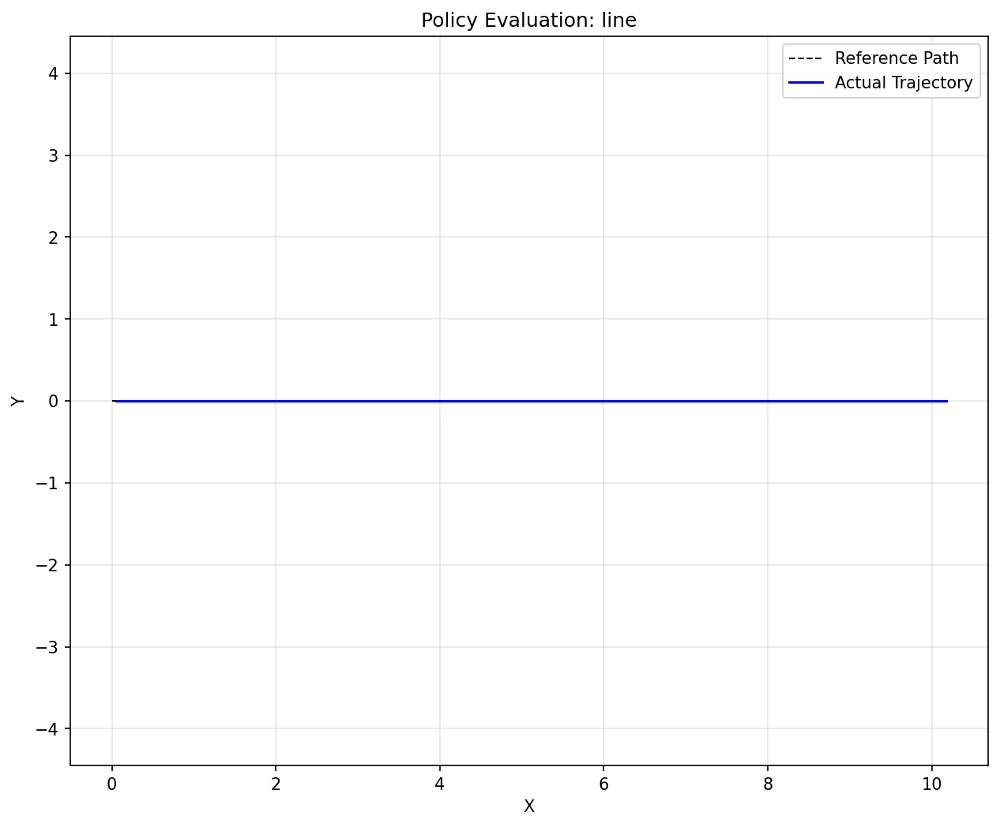
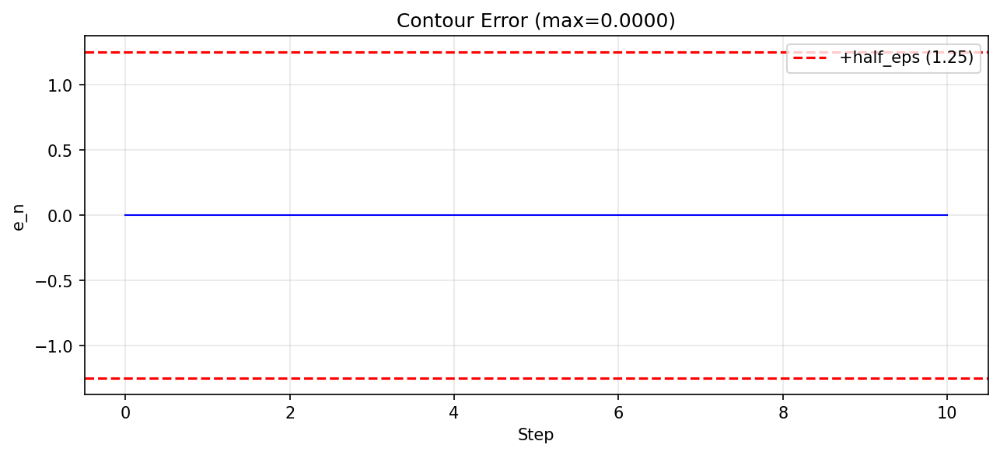

# Phase B 评估报告: line

## 运行信息

- **时间戳**: 2025-12-24T17:31:13.792049
- **Git Hash**: `1966944`
- **随机种子**: 42
- **门禁配置**: `D:\轨迹平滑\基于强化学习的轨迹平滑\PPO_project\configs\phaseB_gates.yaml`
- **Baseline**: `D:\轨迹平滑\基于强化学习的轨迹平滑\PPO_project\artifacts\baseline\baseline.json`

## 总体结果

### ✗ 存在门禁失败

## 指标汇总

| 指标 | 当前值 | Baseline | 差值 |
|------|--------|----------|------|
| 成功率 | 1.0000 | 1.0000 | +0.0 |
| 带内平均速度利用率 | 0.4733 | 0.4733 | +0.0 |
| 每步平均进度 | 0.3992 | 0.0 | **+0.3992** ✓ |
| 最大轮廓误差 | 0.0 | 0.0 | +0.0 |
| 轮廓误差 RMSE | 0.0 | 0.0 | +0.0 |
| 轮廓误差 P95 | 0.0 | 0.0 | +0.0 |
| 曲率变化率 P95 | 0.0 | 0.0 | +0.0 |
| 停滞率 | 0.0 | 0.0 | +0.0 |
| 平均步数 | 11.0000 | - | - |
| 角度Cap激活比例 | 0.0 | 0.0 | +0.0 |

### 门禁检查结果

| 门禁 | 当前值 | 阈值 | 结果 | 来源 |
|------|--------|------|------|------|
| success_rate | 1.0000 | 0.9500 | ✓ PASS | stage1_line.success_rate_min |
| mean_speed_util_in_band | 0.4733 | 0.7000 | ✗ FAIL | stage1_line.mean_speed_util_in_band_min |

### Cap 主导诊断

| 指标 | 值 |
|------|-----|
| cap_ang_active_ratio | 0.0 |
| mean_v_ratio_cap_ang | 1.0000 |
| mean_v_ratio_cap_brake | 0.2516 |
| mean_v_ratio_cap_final | 0.2516 |

> ⚠ **诊断**: `cap_ang_active_ratio` 接近 0，
>   - 检查 corner wiring（`_p8_corner_mode` 是否正确触发）
>   - 确认拐角检测阈值是否合理

## 关键图表

### 轨迹对比

### 轮廓误差

### 速度执行

### 速度上限分解 (v3.1)

### 速度利用率

### 失败定位建议

根据 Phase B 文档第 8 节的失败模式：

**mean_speed_util_in_band 失败**:
- 检查动作有效性（2.1 节）
- 检查效率奖励是否 gated 过严
- 检查平滑惩罚是否过大

---

*本报告由 `make_phaseB_report.py` 自动生成*