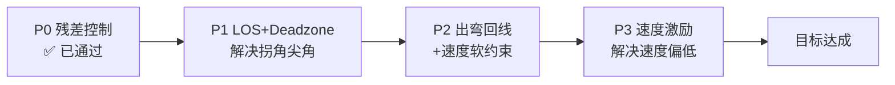

# PPO 轨迹平滑优化实施计划

## 统一运动学参数（P1/P2/P3 共用）

> **重要**：以下参数从 P1 开始生效，所有后续阶段沿用相同配置。

```yaml
kinematic_constraints:
  MAX_VEL: 100.0       # 100 mm/s（即 6000 mm/min）
  MAX_ACC: 2000.0      # 2000 mm/s²
  MAX_JERK: 20000.0    # 20000 mm/s³
  MAX_ANG_VEL: 6.283185307179586   # 2π rad/s
  MAX_ANG_ACC: 100.0   # rad/s²
  MAX_ANG_JERK: 1000.0 # rad/s³
```

---

## 当前问题与目标

| 待解决问题 | 症状描述 | 解决方案 |
|-----------|----------|----------|
| **拐角尖角化** | 拐角处航向突变 | P1: LOS 前瞻 + Deadzone |
| **全程速度偏低** | 速度远未达到 v_max | P3: 速度正激励 |

---

## 优化路径



---

## P1: LOS 前瞻与 Deadzone

**目标**：解决拐角尖角问题

| 机制 | 作用 |
|------|------|
| 动态前瞻 $L(v)$ | 速度越大前瞻越远 |
| Deadzone | 拐角允许切角 |
| 角加速度惩罚 | 迫使转向摊开 |

**文档**: [P1_v4.1_LOS前瞻与deadzone_ZeroActionSmoke_pythoncmd.md](../P1_v4.1_LOS前瞻与deadzone_ZeroActionSmoke_pythoncmd.md)

---

## P2: 出弯回线与速度软约束

**目标**：优化出弯恢复

| 机制 | 作用 |
|------|------|
| 回线奖励 | 仅在 exit window 生效 |
| 速度软约束 | 曲率可达性惩罚 |

**文档**: [P2_v4.1_出弯回线与速度软约束_pythoncmd.md](../P2_v4.1_出弯回线与速度软约束_pythoncmd.md)

---

## P3: 速度激励与直线高效进给

**目标**：解决全程速度偏低问题

| 机制 | 公式/说明 |
|------|----------|
| **速度正激励** | $r_{\text{speed}} = +w_v \cdot (v_{\text{exec}} / v_{\max})$ |
| **直线段识别** | `dist_to_turn > threshold` |
| **直线段速度目标** | `speed_target = 0.95 × v_max` |

**文档**: [P3_v4.1_速度激励与直线高效进给.md](../P3_v4.1_速度激励与直线高效进给.md)

---

## 推荐执行顺序

1. ✅ **P0**: 已通过
2. **P1**: LOS + Deadzone（解决拐角）
3. **P2**: 出弯回线 + 速度软约束
4. **P3**: 速度激励（解决速度偏低）
